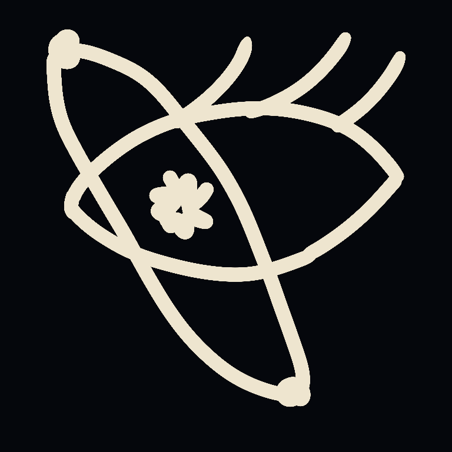

<div align="center">



# Aphelion

**A live, physically accurate model of the solar system that runs entirely offline.**

[](https://github.com/Shinigami92/aphelion/actions/workflows/ci.yml)
[](https://github.com/Shinigami92/aphelion/actions/workflows/deploy-pages.yml)
[](./LICENSE)

**Live: [shinigami92.github.io/aphelion](https://shinigami92.github.io/aphelion/)**

</div>

---

The Sun, eight planets, five dwarf planets, **all 459 named satellites**, 221
catalogued minor planets, ~74,000 belt particles and the 40 Sun-planet Lagrange
points, positioned from real ephemerides at any moment you choose — with a UTC
clock you can pause, reverse, scrub and set by hand.

No network requests at runtime. No third-party APIs. Open it on a plane.

## Quick start

```bash
pnpm install
pnpm dev            # http://localhost:5173
```

Every texture, elevation grid and ephemeris table is committed, so a fresh clone
runs immediately with no network access. See [CONTRIBUTING.md](./CONTRIBUTING.md)
for the scripts, the asset pipeline and how to get a change merged.

---

## Offline

The app never calls out to a third party — every script, texture and ephemeris
table is served from its own origin. A service worker (`public/sw.js`,
registered in production only) closes the last gap: it caches the shell on first
visit and each texture and data module as a flight actually loads it, so a
**reload with no network** still opens on whatever you have already seen.
Navigations are network-first, so a new deploy is picked up the next time you
are online. Add it to a home screen and it launches standalone from the
`manifest.webmanifest`.

---

## Controls

Everything has both a pointer gesture and a key.

**Moving around**

| Input                  | Action                                  |
| ---------------------- | --------------------------------------- |
| drag                   | orbit the focused body                  |
| scroll / pinch         | zoom (scroll sets speed, in free mode)  |
| shift-drag, right-drag | pan                                     |
| `W` `A` `S` `D`        | orbit and zoom (fly, in free mode)      |
| arrows                 | orbit                                   |
| `+` / `−`              | zoom                                    |
| `Shift` / `Alt`        | move faster / finer                     |
| `V`                    | toggle orbit ↔ free flight              |
| `Q` `E`                | roll (both modes)                       |
| `R` `F`                | up / down (free mode)                   |
| `C`                    | point the free camera back at the focus |

**Time**

| Input           | Action                                      |
| --------------- | ------------------------------------------- |
| `Space`         | pause / resume                              |
| `J` / `L`       | run backwards / forwards                    |
| `[` / `]`       | slower / faster (1 sec/s up to 100 years/s) |
| `,` / `.`       | step one unit back / forward                |
| `N`             | jump to now, real-time                      |
| click the clock | type an exact UTC date and time             |

**Selection and display**

| Input                | Action                               |
| -------------------- | ------------------------------------ |
| click / double-click | select / fly to, as a timed approach |
| `Tab`                | next planet                          |
| `1`–`9`, `0`         | Mercury…Pluto, the Sun               |
| `/`                  | search all 687 bodies                |
| `Home`               | frame the whole system               |
| `T`                  | true ↔ explore scale                 |
| `O` `M`              | cycle orbit lines / labels           |
| `B` `K` `I`          | belts / rings / atmospheres          |
| `X`                  | Lagrange points                      |
| `P`                  | render quality                       |
| `H` or `?`           | keyboard map                         |

Every panel folds away individually — click the chevron in its header and it
collapses to that header alone, so you can clear the view without losing the
clock reading or which body is selected. Panels sharing an edge follow each other
as they move: the body browser tracks both the clock above it and the view
options below, and the info panel grows into the corner when the orrery map
folds.

**On a phone** the same panels rearrange rather than disappear. The clock docks
across the top and the other four become sheets, one at a time, from a tab bar at
the bottom — sliding up in portrait, and in from the side in landscape, where
height is the scarce dimension and a bottom sheet would leave no scene at all.

| Gesture           | Action                 |
| ----------------- | ---------------------- |
| drag              | orbit the focused body |
| pinch             | zoom                   |
| two-finger drag   | pan                    |
| tap a body        | select it              |
| double-tap a body | fly to it              |

The `?` chip shows these instead of the keyboard map when there is no keyboard to
map.

---

## Sharing a view

The URL always describes what you are looking at, so copying it from the address
bar is all it takes to send someone the exact view — same body, same instant,
same angle. A reload restores it too, rather than resetting to Earth.

```
?t=2024-04-08T18:17:16Z&focus=earth&mode=true&rate=-86400&paused=1
 &az=3.877&el=0.3&d=25.4&orbits=all&labels=all&belts=0
```

| Parameter                                                 | Meaning                                                                              |
| --------------------------------------------------------- | ------------------------------------------------------------------------------------ |
| `t`                                                       | UTC instant, `YYYY-MM-DDTHH:MM:SSZ`                                                  |
| `focus`                                                   | body key the camera orbits, e.g. `earth`, `moon:Io`, `sb:Vesta`, `lagrange:earth:L2` |
| `sel`                                                     | selected body, only when it differs from the focus                                   |
| `mode`                                                    | `explore` (default) or `true`                                                        |
| `rate`                                                    | signed simulated seconds per real second; `-86400` is a day per second, backwards    |
| `paused`                                                  | `1` when the clock is held                                                           |
| `az`, `el`                                                | camera azimuth and elevation about the focus, radians                                |
| `d`                                                       | camera distance **in radii of the focused body**                                     |
| `cam`                                                     | `free` when the camera is flying rather than orbiting                                |
| `fp`, `fq`                                                | free-flight position (in radii of the focus) and orientation quaternion              |
| `orbits`, `labels`                                        | `none` / `planets` / `all` and `none` / `major` / `all`                              |
| `belts`, `rings`, `atmo`, `milkyway`, `minor`, `lagrange` | `0` to switch a layer off                                                            |

`milkyway` keeps its name from before the sky had stars in it; it now switches
the whole backdrop, so links shared then still resolve to what they meant.

Free flight is carried too, which is what makes a link shareable rather than
merely a bookmark: `cam=free` with a position and an orientation, so a reload
puts you back where you were _facing the way you were facing_. Orbit mode can
reconstruct its aim from the focus; free flight cannot, and without the
quaternion a reload swings the camera back to stare at the focused body.

Two details worth knowing. Distance is stored in _body radii_ rather than
kilometres, so a link frames its subject identically whether the recipient lands
in explore or true scale. And only non-default values are written, so the URL
stays short and readable — render quality is deliberately **not** shared, since it
depends on the viewer's hardware, not the view.

Anything unparseable is ignored rather than fatal: a truncated or hand-edited
link still opens, just with fewer things restored.

---

## The two scale models

The solar system is mostly vacuum. At true scale, if Earth is one pixel the Sun
is 108 pixels away and Neptune is 3,200 — you cannot see an orbit and a planet in
the same image.

So there are two models, and **both preserve every angle and direction exactly**.
Only radial distances and body radii are remapped, so the view is never wrong
about _where_ anything is, only about how far away it is.

- **True** — 1:1. Metrically honest, and genuinely humbling.
- **Explore** (default) — bodies enlarged by a constant factor, so relative sizes
  stay true; heliocentric distances compressed by a power law; satellite
  distances compressed in units of the parent's radius so each moon system stays
  visible around its enlarged planet. Both power laws are monotone, so if A is
  further out than B, it still is after remapping.

Press `T` to cross-fade between them.

---

## How accurate is it?

Positions come from real theory, not from decoration: JPL's Keplerian planetary
elements, the 60-term Meeus/ELP-2000 lunar theory, JPL mean elements for every
satellite, Minor Planet Center elements for the minor planets, IAU orientation
models, and Lagrange points solved rather than approximated. Set the clock to the
total solar eclipse of 8 April 2024 and the rendered umbra lands within about
130 km of NASA's published point of greatest eclipse.

[docs/accuracy.md](./docs/accuracy.md) has the sources, the end-to-end eclipse
check, how the Lagrange points are solved, what `pnpm validate` checks, and the
known limitations.

---

## Documentation

- [docs/accuracy.md](./docs/accuracy.md) — ephemeris sources, validation and known limitations
- [docs/rendering.md](./docs/rendering.md) — what the renderer actually does: shadows, atmospheres, floating origin, the sky
- [ATTRIBUTION.md](./ATTRIBUTION.md) — where every texture, grid and table comes from, and what is measured versus synthesised
- [CONTRIBUTING.md](./CONTRIBUTING.md) — setup, scripts, repository layout, conventions

---

## Contributing

Contributions are welcome. Please read [CONTRIBUTING.md](./CONTRIBUTING.md)
first, and run `pnpm run preflight` before opening a pull request.

---

## License

Project code: [MIT](./LICENSE).

Third-party data and imagery keep their own licences — in particular the Solar
System Scope textures are CC BY 4.0 and **require attribution**. See
[ATTRIBUTION.md](./ATTRIBUTION.md).
